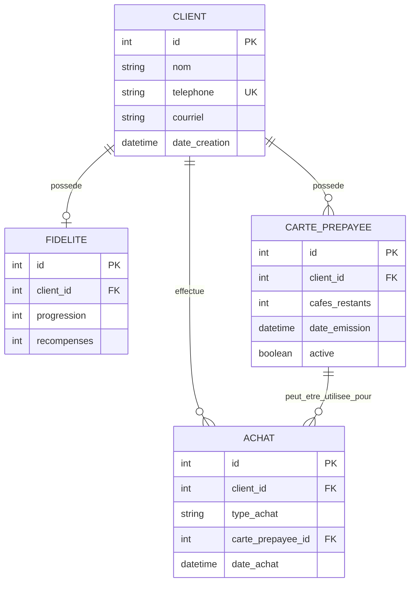

# Conception — Système de fidélité pour un café

## 1. Présentation

Cette application est un système local de gestion de fidélité destiné à un café.

Elle permet principalement :

* d'enregistrer et rechercher des clients ;
* d'enregistrer les achats de cafés ;
* de suivre la progression du programme de fidélité ;
* d'accorder une récompense après 10 cafés achetés ;
* d'utiliser une récompense pour obtenir un café gratuit ;
* d'émettre des cartes prépayées contenant 11 cafés ;
* de suivre l'utilisation des cartes prépayées.

L'application est développée avec Python et Django et utilise SQLite comme base de données.

---

## 2. Entités principales

Le système repose sur quatre entités principales :

### Client

Représente un client inscrit au programme.

Attributs principaux :

* `id` : identifiant unique ;
* `nom` : nom du client ;
* `telephone` : numéro de téléphone unique utilisé pour identifier le client ;
* `courriel` : adresse courriel facultative ;
* `date_creation` : date d'inscription du client.

### Fidelite

Représente l'état du programme de fidélité d'un client.

Attributs principaux :

* `id` : identifiant unique ;
* `client` : client associé ;
* `progression` : nombre de cafés payants comptabilisés vers la prochaine récompense ;
* `recompenses` : nombre de cafés gratuits disponibles.

Une fidélité appartient à un seul client et un client possède au maximum un état de fidélité.

### Achat

Représente un café enregistré dans le système.

Attributs principaux :

* `id` : identifiant unique ;
* `client` : client ayant effectué l'achat ou utilisé un avantage ;
* `type_achat` : type de l'opération ;
* `carte_prepayee` : carte utilisée, lorsqu'il s'agit d'un café prépayé ;
* `date_achat` : date et heure de l'opération.

Trois types d'achats sont actuellement supportés :

* `PAYANT` : achat normal faisant progresser la fidélité ;
* `GRATUIT_FIDELITE` : café obtenu grâce à une récompense ;
* `PREPAYE` : café consommé à partir d'une carte prépayée.

### CartePrepayee

Représente une carte de 11 cafés achetée par un client.

Attributs principaux :

* `id` : identifiant unique ;
* `client` : propriétaire de la carte ;
* `cafes_restants` : nombre de cafés encore disponibles ;
* `date_emission` : date d'émission de la carte ;
* `active` : indique si la carte peut encore être utilisée.

---

## 3. Diagramme entité-relation



### Cardinalités

Les principales relations sont :

* un `Client` possède au maximum une `Fidelite` ;
* un `Client` peut avoir plusieurs `Achat` ;
* un `Client` peut posséder plusieurs `CartePrepayee` ;
* une `CartePrepayee` peut être associée à plusieurs `Achat` de type `PREPAYE` ;
* un `Achat` peut ne pas avoir de carte prépayée associée.

---

## 4. Diagramme ASCII

Le même modèle peut être représenté de façon simplifiée comme suit :

```text
                         ┌──────────────────────┐
                         │        CLIENT        │
                         ├──────────────────────┤
                         │ id                   │
                         │ nom                  │
                         │ telephone (unique)   │
                         │ courriel             │
                         │ date_creation        │
                         └──────────┬───────────┘
                                    │
                  ┌─────────────────┼─────────────────┐
                  │ 1               │ 1               │ 1
                  │                 │                 │
                  │ 0..1            │ 0..N            │ 0..N
                  ▼                 ▼                 ▼
       ┌──────────────────┐ ┌──────────────────┐ ┌────────────────────┐
       │     FIDELITE     │ │      ACHAT       │ │  CARTE_PREPAYEE   │
       ├──────────────────┤ ├──────────────────┤ ├────────────────────┤
       │ id               │ │ id               │ │ id                 │
       │ client_id        │ │ client_id        │ │ client_id          │
       │ progression      │ │ type_achat       │ │ cafes_restants     │
       │ recompenses      │ │ date_achat       │ │ date_emission      │
       └──────────────────┘ │ carte_prepayee_id│ │ active             │
                            └────────▲─────────┘ └──────────┬─────────┘
                                     │                      │
                                     │       0..N           │ 1
                                     └──────────────────────┘
                                      achats avec la carte
```

---

## 5. Choix d'identification du client

Le numéro de téléphone est utilisé comme principal moyen de recherche et d'identification du client.

Le champ `telephone` est donc unique.

Nous avons préféré le téléphone au nom, car plusieurs clients peuvent avoir le même nom. Le courriel reste facultatif afin de ne pas empêcher l'inscription d'un client qui ne souhaite pas le fournir.

---

## 6. Programme de fidélité

Le programme de fidélité et les cartes prépayées sont traités comme deux mécanismes distincts.

Pour la fidélité, seuls les achats de type `PAYANT` augmentent la progression.

La règle est :

```text
Achat PAYANT
      |
      v
progression + 1
      |
      v
progression >= 10 ?
   /          \
 NON          OUI
  |            |
  v            v
fin       progression - 10
                |
                v
         recompenses + 1
```

Après 10 achats payants, une récompense est donc ajoutée au compte du client.

La récompense n'est pas utilisée automatiquement.

Par exemple :

```text
Avant le 10e achat :
Progression = 9
Récompenses = 0

10e achat PAYANT :
Progression = 0
Récompenses = 1
```

Cette récompense reste disponible jusqu'à ce que le client décide de l'utiliser.

Lorsqu'elle est utilisée :

```text
Récompenses = 1
       |
       v
Utiliser une récompense
       |
       v
Achat GRATUIT_FIDELITE
       |
       v
Récompenses = 0
```

L'utilisation d'une récompense ne fait pas progresser le compteur de fidélité.

---

## 7. Cartes prépayées

Une carte prépayée contient initialement 11 cafés.

L'application ne gère pas le paiement de la carte. Elle enregistre seulement son émission et son utilisation.

À sa création :

```text
cafes_restants = 11
active = True
```

À chaque utilisation :

```text
Utilisation de la carte
          |
          v
Création Achat PREPAYE
          |
          v
cafes_restants - 1
          |
          v
cafes_restants == 0 ?
       /       \
     NON       OUI
      |         |
      v         v
   Active    active = False
```

Une carte arrivée à zéro reste enregistrée afin de conserver son historique, mais elle ne peut plus être utilisée.

Un même client peut posséder plusieurs cartes au cours du temps.

---

## 8. Interaction entre fidélité et carte prépayée

Nous avons choisi de ne pas faire progresser le programme de fidélité lorsqu'un café est consommé avec une carte prépayée.

Les trois opérations ont donc des comportements distincts :

```text
PAYANT
  |
  +--> crée un Achat
  +--> progression fidélité + 1


GRATUIT_FIDELITE
  |
  +--> crée un Achat
  +--> récompenses - 1
  +--> progression inchangée


PREPAYE
  |
  +--> crée un Achat
  +--> cafés restants sur la carte - 1
  +--> progression fidélité inchangée
```

Cette décision évite qu'une même consommation bénéficie à la fois du mécanisme prépayé et du mécanisme de fidélité.

---

## 9. Organisation de la logique métier

La logique métier n'est pas placée directement dans les vues Django.

Elle est principalement regroupée dans `services.py`.

L'architecture utilisée est :

```text
Utilisateur
    |
    v
Template HTML
    |
    v
views.py
    |
    v
services.py
    |
    v
models.py
    |
    v
SQLite
```

Les vues sont principalement responsables de :

* recevoir les requêtes HTTP ;
* récupérer les informations envoyées par les formulaires ;
* appeler les services appropriés ;
* préparer les données pour les templates ;
* rediriger l'utilisateur ;
* afficher les messages de succès ou d'erreur.

Les services sont responsables des règles métier telles que :

```text
enregistrer_achat_payant()
utiliser_recompense()
emettre_carte_prepayee()
utiliser_carte_prepayee()
```

---

## 10. Principes de conception appliqués

### Encapsuler ce qui varie

Les règles de fidélité et de cartes prépayées sont regroupées dans `services.py`.

Ces règles sont susceptibles d'évoluer davantage que l'affichage des pages.

Par exemple, si le programme passe plus tard de :

```text
10 cafés → 1 récompense
```

à une autre règle, la modification pourra principalement être effectuée dans la couche de services.

### Préférer la composition à l'héritage

Nous n'avons pas créé des classes telles que :

```text
ClientFidele
ClientAvecCarte
ClientAvecRecompense
```

Un `Client` est plutôt associé à différents objets :

```text
Client
  |
  +-- Fidelite
  |
  +-- Achat
  |
  +-- CartePrepayee
```

Cette approche utilise la composition et les relations entre objets plutôt qu'une hiérarchie d'héritage inutile.

### Single Responsibility Principle

Les principales responsabilités sont séparées :

```text
Client
→ informations du client

Fidelite
→ état de la fidélité

Achat
→ historique des cafés enregistrés

CartePrepayee
→ état d'une carte

views.py
→ interaction HTTP

services.py
→ règles métier
```

Cette séparation limite le nombre de raisons pour lesquelles chaque partie du système devrait être modifiée.

### Open/Closed Principle

La séparation entre les différents types d'achats et les services facilite l'ajout futur de nouvelles règles sans devoir réécrire entièrement les fonctionnalités existantes.

L'architecture cherche donc à préparer l'extension du système sans anticiper inutilement toutes les fonctionnalités des prochains devoirs.

### Autres principes SOLID

Les principes de substitution de Liskov, de ségrégation des interfaces et d'inversion des dépendances ne sont pas fortement sollicités dans cette première version.

Nous avons choisi de ne pas introduire artificiellement des interfaces ou des hiérarchies de classes uniquement pour démontrer ces principes.

Ils pourront devenir plus pertinents lors de l'évolution du système.

---

## 11. Décisions concernant les zones grises

### Fidélité et prépayé : un ou deux mécanismes ?

**Décision : deux mécanismes distincts.**

La fidélité représente une récompense acquise grâce aux achats payants réguliers, tandis que la carte prépayée représente un ensemble de cafés déjà acquis à l'avance.

Cette séparation rend leurs règles indépendantes et facilite leur évolution.

### Café gratuit automatique ou récompense stockée ?

**Décision : récompense stockée.**

Après 10 achats payants, le système ajoute une récompense disponible au client.

Le café gratuit n'est donc pas automatiquement consommé au prochain passage.

Cette approche sépare :

```text
gagner une récompense
```

de :

```text
utiliser une récompense
```

Elle permettra également plus facilement d'ajouter ultérieurement des règles comme une date d'expiration ou différents types de récompenses.

### Comment identifier un client ?

**Décision : numéro de téléphone unique.**

Le nom est conservé comme information descriptive et le courriel est facultatif.

Le téléphone permet une recherche simple au comptoir tout en évitant l'ambiguïté de plusieurs clients portant le même nom.

---

## 12. Évolutivité

Cette première version cherche à satisfaire les besoins actuels sans prévoir prématurément toutes les fonctionnalités futures.

Les choix de conception ont toutefois été faits afin que le produit puisse évoluer progressivement.

La séparation entre :

```text
Client
Fidelite
Achat
CartePrepayee
services.py
views.py
```

permet de modifier les règles métier et d'ajouter de nouvelles fonctionnalités sans concentrer toute la logique dans une seule classe ou une seule vue.
